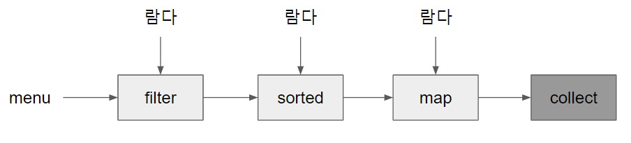

    거의 모든 자바 애플리케이션은 컬렉션을 만들고 처리하는 과정을 포함한다.
    컬렉션으로 데이터를 그룹화하고 처리할 수 있다.
    대부분의 자바 애플리케이션에서는 컬렉션을 많이 사용하지만 완벽한 컬렉션 관련 연산을 지원하려면 한참 멀었다.
    SQL에서는 질의를 어떻게 구현해야 할지 명시할 필요가 없으며 자동으로 제공된다.
    컬렉션으로도 이와비슷한 기능을 만들수 없을까?
    커다란 컬렉션은 병렬처리해야하는데 병렬 처리 코드는 단순 반복 코드보다 복잡하고 어렵다. 복잡한 코드는 디버깅도 어렵다.

위와같은 고심 끝에 스트림이 등장.

### 스트림이란?
자바8에 새로 추가된 기능이다.
선언형(데이터를 처리하는 임시 구현 코드 대신 질의로 표현)으로 컬렉션 데이터를 처리할 수 있다.
데이터 컬렉션 반복을 멋지게 처리하는 기능이며 멀티스레드 코드를 구현하지 않아도 데이터를 투명하게 처리할 수 있다. 

filter (또는 sorted, map, collect) 같은 여러 빌딩 블록 연산을 연결해서 복잡한 데이터 처리 파이프 라인을 만들 수 있다.
이를 통해 우린 데이터 처리 과정을 병렬화 하면서 스레드와 락을 걱정할 필요가 없다.

### 자바8 스트림 API 특징
- 선언형 : 더 간결하고 가독성이 좋아짐
- 조립할 수 있음 : 유연성이 좋아짐  
- 병렬화 : 성능이 좋아짐

### 스트림이란 '정확히' 뭘까?
데이터 처리 연산(filter, map, reduce, find, match, sort 등)을 지원하도록 소스(컬렉션, 배열, I/O자원 등)에서 추출된 연속된 요소

### 스트림 주요 특징
- 파이프 라이닝 : 스트림 연산끼리 연결해서 커다란 파이프 라인
- 내부 반복 : 반복자를 이용한 명시적 반복 수행인 컬렉션과 달리 내부 반복 지원
