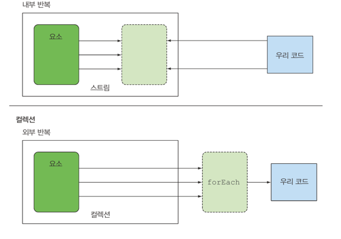

### 스트림이란 무엇인가?

스트림을 이용하면 선언형(즉, 데이터를 처리하는 임시 구현 코드 대신 질의로 표현할 수 있다.)으로 데이터를 처리할수 있다. 또한 멀티스레드를 구현하지 않아도 데이터를 **투명하게** 병렬로 처리할 수 있다.

```java
public class Stream {
    public static void java7() {
        List<Dish> lowCaloricDishes = new ArrayList<>();
        for (Dish dish : menu) {
            if (dish.getCalories() < 400) {
                lowCaloricDishes.add(dish);
            }
        }
        Collections.sort(lowCaloricDishes, new Comparator<Dish>() {
            @Override
            public int compare(Dish o1, Dish o2) {
                return Integer.compare(o1.getCalories(), o2.getCalories());
            }
        });
        List<String> lowCaloricDishesName = new ArrayList<>();
        for (Dish dish : lowCaloricDishes) {
            lowCaloricDishesName.add(dish.getName());
        }
        System.out.println("lowCaloricDishesName = " + lowCaloricDishesName);
    }

    public static void java8() {
        List<String> lowCaloricDishesName = menu.stream()
                .filter(d -> d.getCalories() < 400)
                .sorted(comparing(Dish::getCalories))
                .map(Dish::getName)
                .collect(toList());
        System.out.println("lowCaloricDishesName = " + lowCaloricDishesName);
    }
}
```

선언형으로 코드르 구현할 수 있기 때문에 루프와 if 조건문등의 제어 블록을 사용해서 어떻게 동작할지 지정할 필요가 없다.  
선언형 코드와 동작 파라미터화를 통해서 변하는 요구사항에 쉽게 대응할 수 있다.

filter 같은 연산은 인해 고수준 빌딩 블록으로 이뤄져있으므로 특정 스레딩 모델에 제한되지 않고 어떤 상황에서든 사용할수 있다.
병렬화 하면서 스레드와 락을 걱정할 필요가 없다.

장점
- 선언형 : 더 간결하고 가독성이 좋아진다.
- 조립할 수 있음 : 유연성이 좋아진다.
- 병렬화 : 성능이 좋아진다.

###스트림 시작하기
스트림의 정의는 '데이터 처리 연산을 지원하도록 소스에서 추출된 연속된 요소'

- 연속된 요소 : 컬렉션과 마찬가지로 스트림은 특정 요소 형식으로 이루어진 연소된 값 집합의 인터페이스르 제공한다.  But, 컬렉션의 주체는 데이터, 스트림의 주체는 계산
- 소스 : 스트림은 데이터 제공 소스로부터 데이터를 소비한다 -> 즉, 정렬된 컬렉션으로 스트림을 새엇ㅇ하면 정렬이 그대로 유자ㅣ도니다.
- 데이터 처리 연산 : 스트림은 함수형 프로그래밍 언어에서 일반적으로 지원하는 연산과 데이터베이스와 비슷한 연산을 지원한다. 스트림 연산은 순차적으로 또는 병렬로 실행할 수 있다.

주요 특징
- 파이프라이닝 : 대부분의 스트림 연산은 스트림연산끼리 연걸해서 커다란 파이프라인을 구성할 수 있도록 스트림 자신을 반환한다.
  그덕분에 laziness, short circuiting 같은 최적화도 얻을 수 있다.
- 내부 반복 : 반복자를 이요해서 명시적으로 반복하는 컬레겻노가 달리 스트림은 내부 반복을 지원한다.

스트림 연산
- filter : 람다를 인수로 받아 스트림에서 특정요소를 제외시킨다.
- map : 람다를 이용해서 한요소를 다른요소로 변환하거나 정보를 추출
- limit : 정해진 개수 이상의 요소가 스트림에 저장되지 못하게 스트림 크기를 축소한다.
- collect : 스트림을 다른 형식으로 변환한다.

### 스트림과 컬렉션
자바의 기존 컬렉션과 새로운 스트림 모두 연속된 요소 형식의 값을 저장하는 자료구조의 인터페이스를 제공한다.
데이터를 언제 게산하느냐가 가장 큰 차이 ->

컬렉션은 현재 자료구조가 포함하는 모든 값을 메모리에 저장하는 구조 / 스트림은 요청할 때만 요소를 계산하는 고정된 자료구조

반복자와 마찬가지로 스트림은 한번만 탐색할수있다. 탐색된 스트림의 요소는 소비된다.

컬렉션 인터페이스를 사용하면 사용자가 직접 요소를 반복해야한다. -> 외부 반복
스트림 라이브러리는 반복을 알아서 처리하고 결과 스트림 값을 어딘가에 저장해준다. -> 내부반복(병렬성을 스스로 관리 안해도됨)

### 스트림 연산
스트림에서 연산은 두 그룹으로 나눌수있다.
중간 연산: filter, map, limit
중간연산은 다른 스트림을 반환한다. 따라서 여러 중간 연산을 연결해서 질의를 만들 수 있다.
중요한 특징은 단말 연산을 스트림 파이프라인에 실행하기 전까지는 아무연산도 수행하지 않는다는것(lazy)이다. 이를 통해서 쇼트서킷과 루프 퓨전이 일어난다 .

```java
    import static java.util.stream.Collectors.toList;
    List<String> threeHighCaloricDishNames = 
        menu.stream()                                     // 메뉴(요리 리스트)에서 스트림 얻기         
            .filter(dish -> dish.getCalories() > 300)     // 파이프라인 연산 만들기 1. 고칼로리 요리 필터링
            .map(Dish::getName)                           // 파이프라인 연산 만들기 2. 요리명 추출
            .limit(3)                                     // 파이프라인 연산 만들기 3. 선착순 세 개만 선택
            .collect(toList());                           // 결과를 다른 리스트로 저장
    System.out.println(threeHighCaloricDishNames);        // 결과는 ex) [pork,beef,chicken]이다.
```

| 연산       | 반환 형식           | 연산의 인수               | 함수 디스크립터     |  
|----------|-----------------|----------------------|--------------|
| filter   | String&lt;T&gt; | Predicate&lt;T&gt;   | T -> boolean |
| map      | String&lt;R&gt; | Function&lt;T, R&gt; | T -> R       |
| limit    | String&lt;T&gt; |                      |              |
| sorted   | String&lt;T&gt; | Comparator&lt;T&gt;  | T, T -> int  |
| distinct | String&lt;T&gt; |                      |              |

최종 연산: collect
최정 연산은 스트림 파이프라인에서 결과를 도출한다.

| 연산       | 반환 형식      | 목적                                  |  
|----------|------------|-------------------------------------|
| forEach  | void       | 스트림의 각 요소를 소비하면서 람다를 적용             |
| count    | long       | 스트림의 요소 개수를 반환한다.                   |
| collect  | Collection | 스트림을 리듀스해서 리스트, 맵, 정수 형식의 컬렉션을 만든다. |

스트림 이용과정
- 질의를 수행할 데이터 소스(컬렉션)
- 스트림 파이프라인을 구성할 중간 연산 연결
- 스트림 파이프라인을 실행하고 결과를 만들 최종 연산